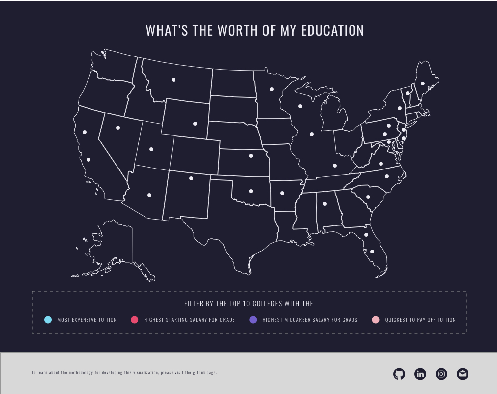
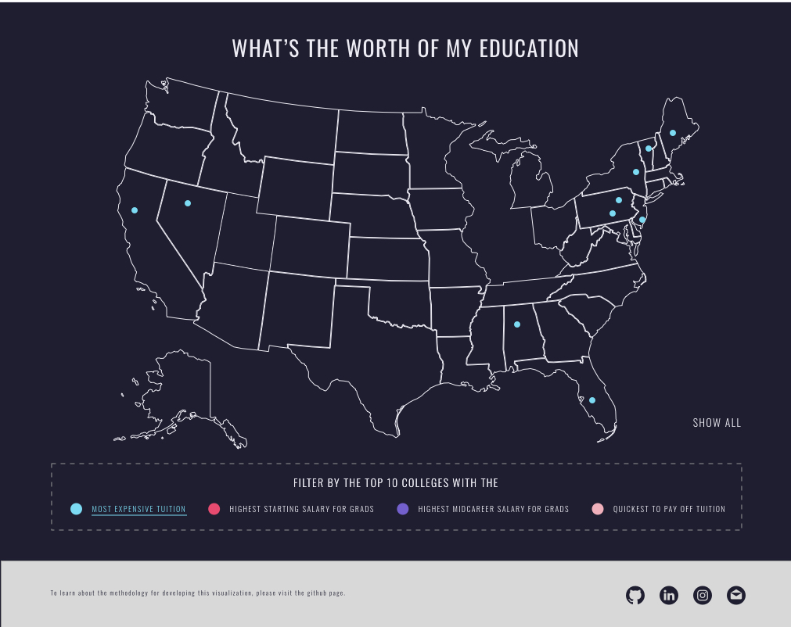
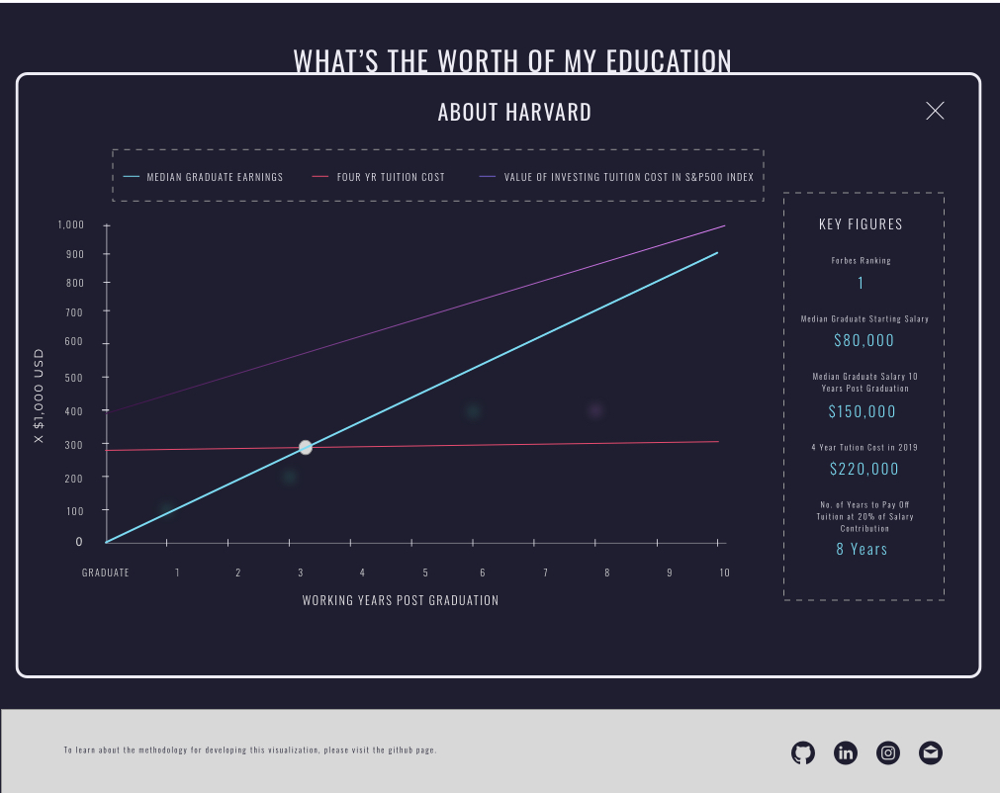

# Worth of Education

## Overview 
College is expensive. In 2019, the average tuition of the top 10 schools reported by Forbes was $224,241. [^1] This number is expected to continue growing while student loan debt sores. According to a study by the Federal Reserve Bank, student loans neared $1.5 trillion in 2019, with each borrower having an average balance of $33,500. [^2] 

Worth of Education (WoE) provides a visualization of the tuition cost and average salary earnings of graduates from Forbes top 50 ranked colleges across America.  WoE calculates the opportunity cost of college tuition by mapping it against the potential earnings of reinvesting into the S&P 500 Index. [^3]  Data regarding salaries has been attained through Wall Street Journal’s release of data from Payscale, Inc’s year long survey of 1.2 million people. Information regarding tuition costs and school ranking has been pulled from Forbes.  

Sources: 
[^1]: College rankings reported by [Forbes](https://www.forbes.com/top-colleges/#95ee07e19877)

[^2]: Information on college debt reported by the [New York Fed](https://libertystreeteconomics.newyorkfed.org/2019/10/who-borrows-for-collegeand-who-repays.html)

[^3]: Average historial annual return of the S&P500 Index is 10% as reported by [Investopedia] (https://www.investopedia.com/ask/answers/042415/what-average-annual-return-sp-500.asp)

### Functionality & MVP
WoE users are able to 
1. View a map of the United States showing the location of Forbes top 50 ranked colleges 
2. Filter out the top 10 colleges on the map by: 
    - Most expensive tuition 
    - Highest median starting salary for graduates
    - Highest median mid-career salary for graduates 
    - Quickest to pay off loans 
3. Hover over each college to view a modal that displays:
    - multi line graph tracing (1) the salary growth of graduates over 10 years (2) horizontal line displaying the tuition cost (3) 10 year investment return of tuition cost in the S&P 500 Index 
    - Key bullet points with data on: tuition cost, working years needed until tuition cost is paid off 

### Data & APIs 
Data on the earnings of graduates from top tier schools is available through direct download on [Kaggle from WSJ](https://www.kaggle.com/wsj/college-salaries)

Tuition costs & college rankings as of 2019 are sourced from [Forbes](https://www.forbes.com/top-colleges/#53215a7e1987) 

### Wireframes

The visualization consists of a single screen containing a map of the United States, a panel to select options to filter the map by adding markers.

### Architecture & Technologies 
WoE is built with:
* `Javascript` for data retrieval and computation 
* `D3.js` + `HTML5` + `SVG` + `CSS3` for interactive visualization 
* `Webpack` + `Babel` to bundle js files 

### Implementation Timeline
1. Day 1:
* Make project proposal 
* Create wireframes
* Identify source data sets 

2. Day 2: 
* Get sign off on project proposal
* Clean data set 
* Convert data to JSON
* Set up map 
* D3 tutorial on map manipulation 

3. Day 3:
* Map filtering 
* Create modal for school info 

4. Day 4: 
* Finish map and modal
* Clean up CSS 
* Test on different browser sizes

5. Day 5: 
*  Fix bugs 

